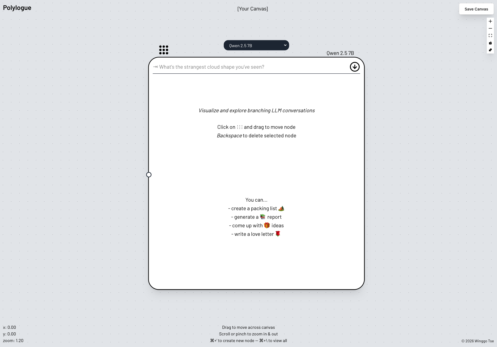
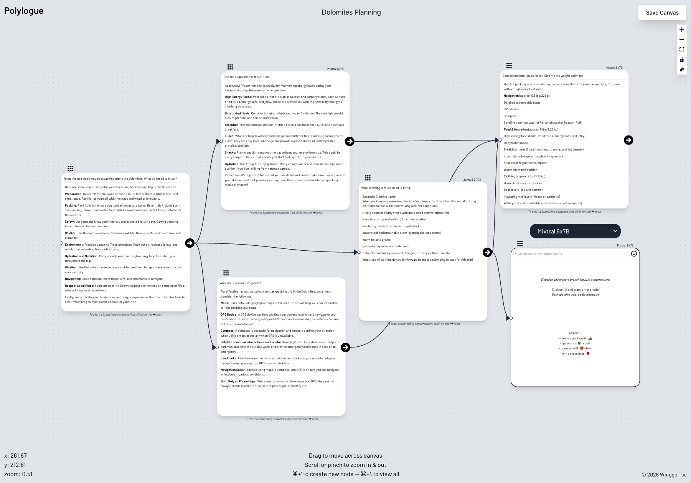

# Polylogue
_discussion or speech involving multiple participants, through multiple forms of communication_

A Figma-like canvas for visualizing and exploring branching LLM conversations.
Each prompt & completion is represented as a tree node, and different models can be selected for each node.

## Goals
- Enable multimodal capabilities such as images
- Enable real-time collaborative editing

## Backlog
- Allow resizing nodes
- Explore templating conversations for different use cases

## Stack
- Next.js & tailwind
- Flask
- Redis
- Firestore
- Langchain
- Together.ai
- GCP

## Deployment
This app is deployed using Google App Engine.
Deploy backend first.
1. Configure `backend/app.yaml` and add any required env variables. Reference `backend/app.example.yaml`.
2. Run `gcloud app deploy` in `backend/`.
    - Run `gcloud app logs tail -s backend` to debug issues.

Deploy frontend second.
1. Configure `frontend/app.yaml` and add any required env variables. Reference `frontend/app.example.yaml`.
2. Run `NEXT_PUBLIC_BACKEND_ROOT_URL=<APP_ENGINE_BACKEND_URL> yarn build`.
    - ex: `NEXT_PUBLIC_BACKEND_ROOT_URL=https://backend-dot-polylogue-123456.ew.r.appspot.com yarn build`
3. Run `gcloud app deploy` in `frontend/`.
    - Run `gcloud app logs tail -s frontend` to debug issues.
